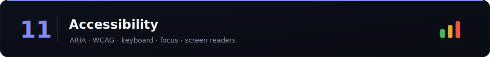

Increasingly a scored dimension in system-design and machine-coding rounds. "Make it keyboard-accessible" is a common curveball.

> Difficulty: 🟢 Easy · 🟡 Medium · 🔴 Hard · [⬆ Back to all sections](../README.md)

> 📚 **[Full question bank — 27 Accessibility questions across 5 categories →](question-bank/README.md)**

## Foundations

| Topic | Difficulty | Time | Tags | Best Resources |
|-------|:----------:|:----:|------|----------------|
| [Semantic HTML first](topics/semantic-html-first.md) | 🟢 | 45m | `#html` `#basics` | [web.dev: structure ⭐](https://web.dev/learn/accessibility/structure) |
| [WCAG & POUR principles](topics/wcag-pour-principles.md) | 🟡 | 1h | `#wcag` | [W3C: WCAG at a glance ⭐](https://www.w3.org/WAI/standards-guidelines/wcag/glance/) |
| [The accessibility tree](topics/the-accessibility-tree.md) | 🟡 | 45m | `#internals` | [web.dev: a11y tree ⭐](https://web.dev/articles/the-accessibility-tree) |
| [Screen readers (how they work)](topics/screen-readers-how-they-work.md) | 🟡 | 45m | `#screen-readers` | [web.dev ⭐](https://web.dev/learn/accessibility/screen-readers) |
| [Color contrast](topics/color-contrast.md) | 🟢 | 30m | `#color` `#wcag` | [web.dev: contrast ⭐](https://web.dev/articles/color-and-contrast-accessibility) |
| [Text alternatives (alt, labels)](topics/text-alternatives-alt-labels.md) | 🟢 | 30m | `#basics` | [web.dev ⭐](https://web.dev/learn/accessibility/images) |

## ARIA & interaction

| Topic | Difficulty | Time | Tags | Best Resources |
|-------|:----------:|:----:|------|----------------|
| [ARIA roles, states, properties](topics/aria-roles-states-properties.md) | 🔴 | 1.5h | `#aria` | [MDN: ARIA ⭐](https://developer.mozilla.org/en-US/docs/Web/Accessibility/ARIA) |
| [ARIA Authoring Practices (patterns)](topics/aria-authoring-practices-patterns.md) | 🔴 | 1.5h | `#aria` `#patterns` | [ARIA APG patterns ⭐](https://www.w3.org/WAI/ARIA/apg/patterns/) |
| [When NOT to use ARIA](topics/when-not-to-use-aria.md) | 🟡 | 30m | `#aria` | [W3C: first rule of ARIA ⭐](https://www.w3.org/TR/using-aria/#firstrule) |
| [Keyboard navigation & tab order](topics/keyboard-navigation-tab-order.md) | 🟡 | 1h | `#keyboard` | [web.dev: keyboard ⭐](https://web.dev/articles/keyboard-access) |
| [Focus management](topics/focus-management.md) | 🔴 | 1h | `#focus` | [MDN ⭐](https://developer.mozilla.org/en-US/docs/Web/Accessibility/Understanding_WCAG/Keyboard) |
| [Focus trapping (modals)](topics/focus-trapping-modals.md) | 🔴 | 45m | `#focus` `#dialog` | [ARIA APG: dialog ⭐](https://www.w3.org/WAI/ARIA/apg/patterns/dialog-modal/) |
| [Live regions & announcements](topics/live-regions-announcements.md) | 🔴 | 45m | `#aria` `#dynamic` | [MDN: live regions ⭐](https://developer.mozilla.org/en-US/docs/Web/Accessibility/ARIA/ARIA_Live_Regions) |
| [Skip links & landmarks](topics/skip-links-landmarks.md) | 🟢 | 30m | `#navigation` | [web.dev ⭐](https://web.dev/learn/accessibility/navigation) |
| [Reduced motion & `prefers-*`](topics/reduced-motion-prefers.md) | 🟡 | 30m | `#motion` | [web.dev ⭐](https://web.dev/articles/prefers-reduced-motion) |

## Accessible components

| Topic | Difficulty | Time | Tags | Best Resources |
|-------|:----------:|:----:|------|----------------|
| [Accessible forms](topics/accessible-forms.md) | 🟡 | 1h | `#forms` | [web.dev: forms ⭐](https://web.dev/learn/forms) |
| Accessible dialogs / modals | 🔴 | 1h | `#dialog` | [ARIA APG: dialog ⭐](https://www.w3.org/WAI/ARIA/apg/patterns/dialog-modal/) |
| Accessible menus & comboboxes | 🔴 | 1h | `#aria` `#patterns` | [ARIA APG: combobox ⭐](https://www.w3.org/WAI/ARIA/apg/patterns/combobox/) |
| Accessible tabs | 🟡 | 45m | `#patterns` | [ARIA APG: tabs ⭐](https://www.w3.org/WAI/ARIA/apg/patterns/tabs/) |
| Accessible tables | 🟡 | 45m | `#tables` | [ARIA APG: table ⭐](https://www.w3.org/WAI/ARIA/apg/patterns/table/) |
| Accessible carousels | 🔴 | 45m | `#patterns` | [ARIA APG: carousel ⭐](https://www.w3.org/WAI/ARIA/apg/patterns/carousel/) |

## Testing

| Topic | Difficulty | Time | Tags | Best Resources |
|-------|:----------:|:----:|------|----------------|
| Automated a11y testing (axe) | 🟡 | 45m | `#testing` `#tooling` | [Deque axe ⭐](https://www.deque.com/axe/) |
| Manual testing with a screen reader | 🟡 | 45m | `#testing` | [web.dev ⭐](https://web.dev/learn/accessibility/test-manual) |

## ❓ Rapid-fire accessibility interview questions

Real a11y questions asked at the SDE-2 / senior level. Answer out loud, then verify above.

1. What is **semantic HTML** and why does it matter for accessibility?
2. What is **ARIA** and when should you **not** use it?
3. What is the **accessibility tree**?
4. How do you make a **custom component keyboard accessible**?
5. What is **focus management** and **focus trapping**?
6. What is an **ARIA live region** and when do you use it?
7. What are WCAG's **POUR principles**?
8. What **color contrast** ratio does WCAG require?
9. How do you make a **modal accessible**?
10. How do you **test accessibility** (automated + manual)?
11. Difference between **`aria-hidden`** and **`display:none`**?
12. How do **screen readers** work?
13. What is a **skip link** and why add one?
14. How do you respect **`prefers-reduced-motion`**?
15. How do you **label form inputs** accessibly?

---

**Related:** [05-css](../05-css/) · [16-machine-coding](../16-machine-coding/) · [14-testing](../14-testing/)

_Missing something? [Add a row](../CONTRIBUTING.md)._
