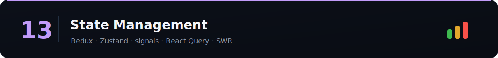

Server state vs client state, and picking the right tool. A favorite "walk me through the trade-offs" topic.

> Difficulty: 🟢 Easy · 🟡 Medium · 🔴 Hard · [⬆ Back to all sections](../README.md)

> 📚 **[Full question bank — 27 State Management questions across 5 categories →](question-bank/README.md)**

## Concepts

| Topic | Difficulty | Time | Tags | Best Resources |
|-------|:----------:|:----:|------|----------------|
| [Client vs server state (the key distinction)](topics/client-vs-server-state-the-key-distinction.md) | 🟡 | 45m | `#concepts` | [TanStack Query: overview ⭐](https://tanstack.com/query/latest/docs/framework/react/overview) |
| [Local component state & lifting](topics/local-component-state-lifting.md) | 🟢 | 30m | `#basics` `#react` | [react.dev ⭐](https://react.dev/learn/sharing-state-between-components) |
| [Context as state (and its limits)](topics/context-as-state-and-its-limits.md) | 🟡 | 45m | `#react` `#performance` | [react.dev ⭐](https://react.dev/learn/scaling-up-with-reducer-and-context) |
| [Flux / unidirectional data flow](topics/flux-unidirectional-data-flow.md) | 🟡 | 45m | `#concepts` | [Redux: three principles ⭐](https://redux.js.org/understanding/thinking-in-redux/three-principles) |
| Normalization | 🔴 | 1h | `#patterns` `#caching` | [Redux: normalizing state ⭐](https://redux.js.org/usage/structuring-reducers/normalizing-state-shape) |
| Derived state & selectors | 🟡 | 45m | `#patterns` | [Reselect ⭐](https://github.com/reduxjs/reselect) |
| Immutability & structural sharing | 🟡 | 45m | `#patterns` | [Immer ⭐](https://immerjs.github.io/immer/) |

## Client-state libraries

| Topic | Difficulty | Time | Tags | Best Resources |
|-------|:----------:|:----:|------|----------------|
| Redux & Redux Toolkit | 🟡 | 1.5h | `#redux` | [Redux Toolkit ⭐](https://redux-toolkit.js.org/introduction/getting-started) |
| Zustand | 🟢 | 45m | `#zustand` | [Zustand ⭐](https://zustand.docs.pmnd.rs/) |
| Jotai (atomic) | 🟡 | 45m | `#jotai` `#atoms` | [Jotai ⭐](https://jotai.org/) |
| Recoil | 🟡 | 45m | `#recoil` `#atoms` | [Recoil ⭐](https://recoiljs.org/) |
| [Signals](topics/signals.md) | 🔴 | 1h | `#signals` `#reactivity` | [Preact signals ⭐](https://preactjs.com/guide/v10/signals/) |
| [MobX](topics/mobx.md) | 🟡 | 1h | `#mobx` `#reactivity` | [MobX ⭐](https://mobx.js.org/README.html) |
| XState (state machines) | 🔴 | 1h | `#state-machine` | [XState ⭐](https://stately.ai/docs) |

## Server-state & data

| Topic | Difficulty | Time | Tags | Best Resources |
|-------|:----------:|:----:|------|----------------|
| [React Query / TanStack Query](topics/react-query-tanstack-query.md) | 🔴 | 1.5h | `#server-state` `#caching` | [TanStack Query ⭐](https://tanstack.com/query/latest) |
| [SWR](topics/swr.md) | 🟡 | 45m | `#server-state` `#caching` | [SWR ⭐](https://swr.vercel.app/) |
| Apollo Client (GraphQL cache) | 🔴 | 1h | `#graphql` `#caching` | [Apollo Client ⭐](https://www.apollographql.com/docs/react/) |
| RxJS & streams | 🔴 | 1.5h | `#rxjs` `#streams` | [RxJS ⭐](https://rxjs.dev/guide/overview) |
| Optimistic updates | 🔴 | 1h | `#patterns` `#ux` | [TanStack: optimistic ⭐](https://tanstack.com/query/latest/docs/framework/react/guides/optimistic-updates) |
| Caching & invalidation strategies | 🔴 | 1h | `#caching` | [TanStack: caching ⭐](https://tanstack.com/query/latest/docs/framework/react/guides/caching) |
| Offline support & persistence | 🔴 | 1.5h | `#offline` `#pwa` | [web.dev: offline ⭐](https://web.dev/articles/offline-cookbook) |
| Undo/redo | 🟡 | 45m | `#patterns` | [Command pattern ⭐](../18-design-patterns/) |

## ❓ Rapid-fire state management interview questions

Real state-management questions asked at the SDE-2 / senior level. Answer out loud, then verify above.

1. What's the difference between **client state and server state**?
2. When do you need a **state library vs Context**?
3. What problem does **Redux** solve? How does the flux pattern work?
4. **Redux vs Zustand vs Jotai** — trade-offs?
5. What is **React Query / SWR** and why use it?
6. What are **optimistic updates** and how do you roll back?
7. What is **state normalization** and why do it?
8. How do you avoid unnecessary **re-renders with Context**?
9. What are **signals** and how do they differ from React state?
10. How do you **persist state** (localStorage/IndexedDB)?
11. How do you handle **cache invalidation**?
12. What is a **selector** and why memoize it (reselect)?
13. How do you manage **complex form state**?
14. What is a **state machine** (XState) and when is it useful?
15. How do you **sync state across browser tabs**?

---

**Related:** [06-react](../06-react/) · [12-networking](../12-networking/) · [17-interview-patterns](../17-interview-patterns/)

_Missing something? [Add a row](../CONTRIBUTING.md)._
