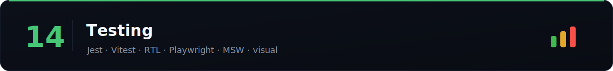

How you prove the thing works. Expect "how would you test this?" after any machine-coding round.

> Difficulty: 🟢 Easy · 🟡 Medium · 🔴 Hard · [⬆ Back to all sections](../README.md)

> 📚 **[Full question bank — 28 Testing questions across 5 categories →](question-bank/README.md)**

## Strategy

| Topic | Difficulty | Time | Tags | Best Resources |
|-------|:----------:|:----:|------|----------------|
| [The testing pyramid / trophy](topics/the-testing-pyramid-trophy.md) | 🟢 | 30m | `#strategy` | [Kent C. Dodds: testing trophy ⭐](https://kentcdodds.com/blog/the-testing-trophy-and-testing-classifications) |
| [What to test (and what not to)](topics/what-to-test-and-what-not-to.md) | 🟡 | 45m | `#strategy` | [Kent C. Dodds: write tests ⭐](https://kentcdodds.com/blog/write-tests) |
| [Test-driven development](topics/test-driven-development.md) | 🟡 | 45m | `#tdd` | [Martin Fowler: TDD ⭐](https://martinfowler.com/bliki/TestDrivenDevelopment.html) |
| [Flaky tests & determinism](topics/flaky-tests-determinism.md) | 🟡 | 45m | `#strategy` | [Playwright: retries ⭐](https://playwright.dev/docs/test-retries) |

## Unit & component

| Topic | Difficulty | Time | Tags | Best Resources |
|-------|:----------:|:----:|------|----------------|
| [Unit testing with Jest](topics/unit-testing-with-jest.md) | 🟢 | 1h | `#unit` `#jest` | [Jest ⭐](https://jestjs.io/docs/getting-started) |
| [Vitest](topics/vitest.md) | 🟢 | 45m | `#unit` `#vitest` | [Vitest ⭐](https://vitest.dev/guide/) |
| [React Testing Library (RTL)](topics/react-testing-library-rtl.md) | 🟡 | 1.5h | `#component` `#rtl` | [Testing Library ⭐](https://testing-library.com/docs/react-testing-library/intro/) |
| [Query priorities & user-centric tests](topics/query-priorities-user-centric-tests.md) | 🟡 | 45m | `#rtl` `#a11y` | [Testing Library: queries ⭐](https://testing-library.com/docs/queries/about/) |
| [Testing hooks](topics/testing-hooks.md) | 🟡 | 45m | `#rtl` `#hooks` | [Testing Library ⭐](https://testing-library.com/docs/react-testing-library/api/#renderhook) |
| [Snapshot testing (and its traps)](topics/snapshot-testing-and-its-traps.md) | 🟡 | 30m | `#unit` | [Jest: snapshots ⭐](https://jestjs.io/docs/snapshot-testing) |

## Mocking

| Topic | Difficulty | Time | Tags | Best Resources |
|-------|:----------:|:----:|------|----------------|
| [Mocking (modules, timers, functions)](topics/mocking-modules-timers-functions.md) | 🟡 | 45m | `#mocking` | [Jest: mock functions ⭐](https://jestjs.io/docs/mock-functions) |
| [Mocking network with MSW](topics/mocking-network-with-msw.md) | 🟡 | 1h | `#mocking` `#msw` | [MSW ⭐](https://mswjs.io/docs/) |
| [Fake timers & async testing](topics/fake-timers-async-testing.md) | 🟡 | 45m | `#mocking` `#async` | [Jest: timer mocks ⭐](https://jestjs.io/docs/timer-mocks) |

## Integration, E2E & specialized

| Topic | Difficulty | Time | Tags | Best Resources |
|-------|:----------:|:----:|------|----------------|
| [Integration testing](topics/integration-testing.md) | 🟡 | 1h | `#integration` | [Kent C. Dodds ⭐](https://kentcdodds.com/blog/write-tests) |
| [E2E with Playwright](topics/e2e-with-playwright.md) | 🔴 | 1.5h | `#e2e` `#playwright` | [Playwright ⭐](https://playwright.dev/docs/intro) |
| [E2E with Cypress](topics/e2e-with-cypress.md) | 🟡 | 1h | `#e2e` `#cypress` | [Cypress ⭐](https://docs.cypress.io/guides/overview/why-cypress) |
| [Visual regression testing](topics/visual-regression-testing.md) | 🟡 | 45m | `#visual` | [Playwright: snapshots ⭐](https://playwright.dev/docs/test-snapshots) |
| [Accessibility testing](topics/accessibility-testing.md) | 🟡 | 45m | `#a11y` | [jest-axe ⭐](https://github.com/nickcolley/jest-axe) |
| [Performance testing / budgets](topics/performance-testing-budgets.md) | 🔴 | 45m | `#performance` | [web.dev: budgets ⭐](https://web.dev/articles/performance-budgets-101) |
| [Component testing (Storybook)](topics/component-testing-storybook.md) | 🟡 | 45m | `#component` | [Storybook: testing ⭐](https://storybook.js.org/docs/writing-tests) |

## ❓ Rapid-fire testing interview questions

Real testing questions asked at the SDE-2 / senior level. Answer out loud, then verify above.

1. What is the **testing pyramid / trophy**?
2. **Unit vs integration vs E2E** — when do you use each?
3. What is **React Testing Library's** philosophy?
4. How do you query elements — **`getBy` vs `queryBy` vs `findBy`**?
5. How do you **mock an API** in tests (MSW)?
6. How do you test **async code and hooks**?
7. What is a **flaky test** and how do you fix it?
8. **Playwright vs Cypress** — trade-offs?
9. What is **snapshot testing** and its pitfalls?
10. How do you **test accessibility** (jest-axe)?
11. What should you **not** test?
12. How do you test a **debounced** function (fake timers)?
13. Is **100% code coverage** the goal? Why or why not?
14. How do you test a component that **fetches data**?
15. What is **visual regression testing**?

---

**Related:** [06-react](../06-react/) · [11-accessibility](../11-accessibility/) · [16-machine-coding](../16-machine-coding/)

_Missing something? [Add a row](../CONTRIBUTING.md)._
