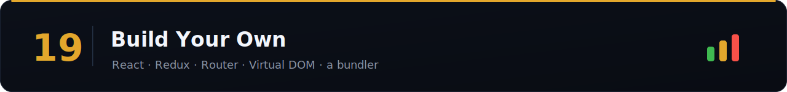

Nothing teaches internals like rebuilding the tools. These projects turn "I use React" into "I understand React" — the difference between Senior and Staff.

> Difficulty: 🟢 Easy · 🟡 Medium · 🔴 Hard · [⬆ Back to all sections](../README.md)

> 📚 **[Full question bank — 30 Build Your Own questions across 5 categories →](question-bank/README.md)**

## React & rendering

| Project | Difficulty | Time | Tags | Best guide |
|---------|:----------:|:----:|------|-----------|
| Build a Virtual DOM | 🔴 | 3h | `#react` `#internals` | [Build your own React ⭐](https://pomb.us/build-your-own-react/) |
| Build React (fiber + hooks) | 🔴 | 6h | `#react` `#internals` | [Didact ⭐](https://pomb.us/build-your-own-react/) |
| Build a JSX → DOM renderer | 🔴 | 3h | `#react` `#compiler` | [Build your own React](https://pomb.us/build-your-own-react/) |
| Build the reconciliation / diff algorithm | 🔴 | 3h | `#react` `#internals` | [Build your own React](https://pomb.us/build-your-own-react/) |
| Build a scheduler (time-slicing) | 🔴 | 3h | `#react` `#concurrent` | [React scheduler source](https://github.com/facebook/react/tree/main/packages/scheduler) |
| Build `useState`/`useEffect` | 🔴 | 2h | `#react` `#hooks` | [Build your own React](https://pomb.us/build-your-own-react/) |
| Build a virtualization library | 🔴 | 3h | `#performance` | [Flagship ⭐](../06-react/build-a-virtualized-list.md) |

## State & data

| Project | Difficulty | Time | Tags | Best guide |
|---------|:----------:|:----:|------|-----------|
| Build Redux | 🟡 | 2h | `#state` | [Redux: prior art ⭐](https://redux.js.org/understanding/history-and-design/prior-art) |
| Build a state store (Zustand-like) | 🟡 | 2h | `#state` | [Zustand source](https://github.com/pmndrs/zustand) |
| Build React Query (cache + fetch) | 🔴 | 4h | `#server-state` | [TanStack Query source](https://github.com/TanStack/query) |
| Build a reactive Signals system | 🔴 | 3h | `#reactivity` | [Preact signals source](https://github.com/preactjs/signals) |
| Build an Event Emitter | 🟢 | 1h | `#patterns` | [Flagship ⭐](../18-design-patterns/observer-event-bus.md) |
| Build a Promise from scratch | 🟡 | 2h | `#async` | [Promises/A+ spec ⭐](https://promisesaplus.com/) |
| Build an LRU cache | 🟡 | 1h | `#data-structures` | [BFE.dev](https://bigfrontend.dev/) |

## Tooling & framework

| Project | Difficulty | Time | Tags | Best guide |
|---------|:----------:|:----:|------|-----------|
| Build a client-side Router | 🟡 | 2h | `#routing` | [MDN: History API ⭐](https://developer.mozilla.org/en-US/docs/Web/API/History_API) |
| Build a module bundler (mini-webpack) | 🔴 | 4h | `#bundling` | [minipack ⭐](https://github.com/ronami/minipack) |
| Build a JS templating engine | 🟡 | 2h | `#compiler` | [Build your own X ⭐](https://github.com/codecrafters-io/build-your-own-x) |
| Build a form library | 🟡 | 3h | `#forms` | [react-hook-form source](https://github.com/react-hook-form/react-hook-form) |
| Build a testing framework (mini-Jest) | 🔴 | 3h | `#testing` | [Build your own X](https://github.com/codecrafters-io/build-your-own-x) |
| Build a CSS-in-JS engine | 🔴 | 3h | `#css` | [Build your own X](https://github.com/codecrafters-io/build-your-own-x) |
| Build a debounce/throttle util | 🟢 | 1h | `#async` | [Flagship ⭐](../03-javascript/promise-polyfills-and-throttle-debounce.md) |

📖 The mega-index: [build-your-own-x ⭐](https://github.com/codecrafters-io/build-your-own-x)

**Related:** [06-react](../06-react/) · [13-state-management](../13-state-management/) · [02-browser](../02-browser/)

_Built a great clone tutorial? [Link it](../CONTRIBUTING.md)._
