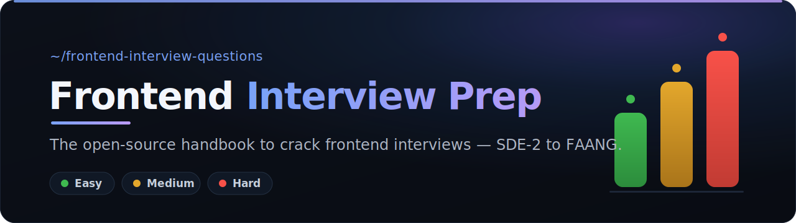

<picture>
  <source media="(prefers-color-scheme: light)" srcset="assets/banner-light.svg" />
  <source media="(prefers-color-scheme: dark)" srcset="assets/banner.svg" />
  
</picture>

  

&nbsp;

&nbsp;

&nbsp;

`21 sections`&nbsp;&nbsp;•&nbsp;&nbsp;`3,000+ questions`&nbsp;&nbsp;•&nbsp;&nbsp;`17 worked solutions`&nbsp;&nbsp;•&nbsp;&nbsp;`16 company guides`

 

&nbsp;

&nbsp;

&nbsp;

&nbsp;

---

## 🤔 Why this repo exists

Backend system design has [`system-design-primer`](https://github.com/donnemartin/system-design-primer). Frontend didn't have one central, community-owned place. Interview prep for frontend is scattered across 50 tabs — random blog posts, YouTube videos, paid courses, half-finished GitHub gists.

**This repo is the map.** It doesn't try to re-write every explanation on the internet. It does something more useful: it gives you the **complete list of what to know**, ranked by difficulty and interview-frequency, and points each item at the single best place to actually learn it. Then it shows you what a *great* answer looks like with fully-worked flagship solutions you can copy as a template.

> Star it ⭐, work through it top-to-bottom, and walk into your interview knowing you didn't miss anything.

---

## 👥 Who is this for?

Built for **frontend / UI engineers at every level** preparing for interviews — from your first job to FAANG:

- **Junior → SDE-1** — lock the [fundamentals](01-fundamentals/), [JavaScript](03-javascript/), [CSS](05-css/), and skim the [FAQ](FAQ.md).
- **Mid-level → SDE-2** *(the sweet spot)* — [machine coding](16-machine-coding/), [React](06-react/) deep-dives, [performance](09-performance/), [state management](13-state-management/), [DSA for frontend](21-dsa-for-frontend/), and your first [system design](15-system-design/) problems.
- **Senior → Staff** — [frontend system design](15-system-design/), [architecture](08-architecture/), [interview patterns](17-interview-patterns/), and [build-your-own](19-build-your-own/) internals.
- **Targeting a company?** Jump to the [company guides](20-company-guides/) — Google, Meta, Amazon, Netflix, Stripe, and more.

---

## 🧭 How to use this repo

1. **Start with the [Roadmap](ROADMAP.md).** It orders everything Beginner → Advanced so you're never lost.
2. **Pick a section below.** Each section's `README` is a curated table — topic, difficulty, time, tags, and the best link.
3. **Study from the linked resource**, then test yourself against the **What interviewers probe** notes in the flagship solutions.
4. **Track your prep** — check off rows as you go.
5. **Found something better?** [Open a PR](CONTRIBUTING.md). This repo gets stronger with every contributor.

### Difficulty legend

| Badge | Meaning | Who it's for |
|:-----:|---------|--------------|
| 🟢 | **Easy** | Fundamentals everyone must know cold |
| 🟡 | **Medium** | SDE-2 / Senior expectations |
| 🔴 | **Hard** | Senior / Staff / FAANG differentiators |

---

## 🔥 Start here — most popular

<table>
<tr>
<td width="33%" valign="top">

### 🏗️ [System Design](15-system-design/)

**90+** "Design X" problems + **7** worked flagships.

→ [News Feed](15-system-design/design-news-feed.md) · [Chat](15-system-design/design-chat-whatsapp-web.md) · [Autocomplete](15-system-design/design-autocomplete.md)

</td>
<td width="33%" valign="top">

### 🧩 [Machine Coding](16-machine-coding/)

**120+** build-this-component tasks + **7** flagships.

→ [Autocomplete](16-machine-coding/autocomplete-component.md) · [Kanban](16-machine-coding/kanban-drag-and-drop.md) · [Modal](16-machine-coding/modal-dialog.md)

</td>
<td width="33%" valign="top">

### ⚡ [JavaScript](03-javascript/)

Core language + tricky output & coding rounds.

→ [Output questions](03-javascript/output-based-questions.md) · [Polyfills](03-javascript/promise-polyfills-and-throttle-debounce.md)

</td>
</tr>
<tr>
<td valign="top">

### 🧠 [DSA for Frontend](21-dsa-for-frontend/)

The DSA slice frontend interviews actually test.

→ [Flatten](21-dsa-for-frontend/) · [LRU cache](21-dsa-for-frontend/) · [DOM traversal](21-dsa-for-frontend/)

</td>
<td valign="top">

### 🏢 [Company Guides](20-company-guides/)

What each company really asks, with prep plans.

→ [Google](20-company-guides/google.md) · [Meta](20-company-guides/meta.md) · [Amazon](20-company-guides/amazon.md)

</td>
<td valign="top">

### ❓ [FAQ](FAQ.md)

Fast answers to the most-searched questions.

→ closures · virtual DOM · CSR vs SSR · AI UIs

</td>
</tr>
</table>

---

## 📚 Explore the full handbook

> 🗂️ **Full question banks** (exhaustive lists, curated from real prep sheets): [1,200+ Machine Coding](16-machine-coding/question-bank.md) · [548 JavaScript](03-javascript/question-bank.md) · [353 System Design](15-system-design/question-bank.md) · [900+ DSA](21-dsa-for-frontend/question-bank.md) · [React](06-react/question-bank.md)

**🧱 Core foundations**

| Section | Key topics | Deep dives |
|---------|------------|-----------|
| [01 · Fundamentals](01-fundamentals/) | DOM, rendering, HTTP, storage, **Web APIs** (Intersection Observer, infinite scroll) | — |
| [02 · Browser Internals](02-browser/) | rendering pipeline, event loop, microtasks, GC | — |
| [03 · JavaScript](03-javascript/) | closures, async, prototypes, polyfills | [Output questions](03-javascript/output-based-questions.md) · [Promises & debounce](03-javascript/promise-polyfills-and-throttle-debounce.md) |
| [04 · TypeScript](04-typescript/) | generics, mapped & conditional types, utility types | — |
| [05 · CSS](05-css/) | flexbox, grid, cascade, container queries, animation | — |

**⚛️ Framework**

| Section | Key topics | Deep dives |
|---------|------------|-----------|
| [06 · React](06-react/) | fiber, hooks, concurrent, RSC, performance | [Build a Virtualized List](06-react/build-a-virtualized-list.md) |
| [07 · Next.js](07-nextjs/) | App Router, caching, streaming, server actions | — |

**🚦 Cross-cutting engineering**

| Section | Key topics |
|---------|------------|
| [08 · Architecture](08-architecture/) | micro-frontends, monorepos, design systems, DDD |
| [09 · Performance](09-performance/) | Core Web Vitals, bundles, images, virtualization |
| [10 · Security](10-security/) | XSS, CSRF, CSP, CORS, auth, JWT |
| [11 · Accessibility](11-accessibility/) | ARIA, WCAG, keyboard, focus, screen readers |
| [12 · Networking](12-networking/) | HTTP/2-3, WebSocket, SSE, GraphQL, CDN, caching |
| [13 · State Management](13-state-management/) | Redux, Zustand, Jotai, signals, React Query, SWR |
| [14 · Testing](14-testing/) | Jest, Vitest, RTL, Playwright, MSW, visual/a11y |

**🎯 The interview**

| Section | What's inside |
|---------|---------------|
| [15 · System Design](15-system-design/) | 90+ "Design X" problems + 7 flagships |
| [16 · Machine Coding](16-machine-coding/) | 120+ components + 7 flagships |
| [17 · Interview Patterns](17-interview-patterns/) | real-time, offline, virtualization, optimistic UI |
| [18 · Design Patterns](18-design-patterns/) | observer, factory, strategy, DI |
| [19 · Build Your Own](19-build-your-own/) | React, Redux, Router, a Virtual DOM |
| [20 · Company Guides](20-company-guides/) | Google, Meta, Amazon, Netflix, Stripe… |
| [21 · DSA for Frontend](21-dsa-for-frontend/) | arrays, trees, recursion + frontend-flavored problems |

---

## ⭐ Flagship worked solutions

These are **fully-solved**, end-to-end — the gold standard for how to answer in an interview. Use them as templates.

### 🏗️ Frontend System Design
- [Design a News Feed / Infinite Scroll](15-system-design/design-news-feed.md) 🔴
- [Design Autocomplete / Typeahead](15-system-design/design-autocomplete.md) 🟡
- [Design a Chat App (WhatsApp Web)](15-system-design/design-chat-whatsapp-web.md) 🔴
- [Design Google Docs (collaborative editing)](15-system-design/design-google-docs.md) 🔴
- [Design an Image Carousel at scale](15-system-design/design-image-carousel.md) 🟡
- [Design a Notification System](15-system-design/design-notification-system.md) 🔴
- [Design a Video Player](15-system-design/design-video-player.md) 🔴

### 🧩 Machine Coding
- [Build an Autocomplete component](16-machine-coding/autocomplete-component.md) 🟡
- [Build Nested Comments (tree)](16-machine-coding/nested-comments.md) 🟡
- [Build a Kanban board (drag & drop)](16-machine-coding/kanban-drag-and-drop.md) 🔴
- [Build a Star Rating widget](16-machine-coding/star-rating.md) 🟢
- [Build a Data Grid (sortable, virtualized)](16-machine-coding/data-grid.md) 🔴
- [Build an Accessible Modal / Dialog](16-machine-coding/modal-dialog.md) 🟡
- [Build a Command Palette (⌘K)](16-machine-coding/command-palette.md) 🔴

### 🔬 Deep Dives
- [JS: Promise polyfills + debounce/throttle](03-javascript/promise-polyfills-and-throttle-debounce.md) 🟡
- [JS: Output-based questions (with answers)](03-javascript/output-based-questions.md) 🟡
- [React: Build a Virtualized List](06-react/build-a-virtualized-list.md) 🔴
- [Patterns: Event Bus / Observer](18-design-patterns/observer-event-bus.md) 🟡
- [DSA for Frontend](21-dsa-for-frontend/) 🟡

---

## 🗺️ Study paths

Short on time? Follow a track instead of reading everything. Full detail in the **[Roadmap](ROADMAP.md)**.

- **⚡ 2-Week Crash** — Fundamentals → JS → React → 5 flagship system designs
- **📈 SDE-2 → Senior** — everything at 🟢/🟡 + Performance + State + a11y
- **🎯 Staff / FAANG** — all 🔴 topics + Architecture + Build-Your-Own + Company Guides

---

## 🤝 Contributing

This repo is **community-owned**. Add a topic, fix a link, contribute a flagship solution, or share a question a company asked you. Start here 👉 **[CONTRIBUTING.md](CONTRIBUTING.md)** and copy the **[TEMPLATE.md](TEMPLATE.md)**.

Good first contributions:
- 🔗 Replace a "best resource" link with a better one
- ➕ Add a missing topic row to a section table
- ✍️ Turn an index topic into a full flagship solution
- 🏢 Add a real interview question to a [company guide](20-company-guides/)

---

## 🔎 Topics covered

A complete **frontend interview preparation** resource and **frontend interview questions** bank covering: **frontend system design**, **machine coding** rounds, **JavaScript interview questions**, **React interview questions**, **TypeScript**, **CSS** and **HTML**, **browser internals**, **web performance** (Core Web Vitals — LCP, CLS, INP), **accessibility (a11y)**, **web security** (XSS, CSRF, CSP), **networking** (HTTP, WebSocket, GraphQL), **state management**, **testing**, **design patterns**, **DSA for frontend** (data structures & algorithms), and **JavaScript output-based ("guess the output") questions** — plus **company-wise interview guides** for Google, Meta, Amazon, Netflix, Airbnb, Uber, Stripe, Microsoft, Atlassian, LinkedIn, Apple, Cloudflare, DoorDash, Pinterest, and Dropbox. Whether you're preparing for **SDE-2, Senior, Staff, or FAANG frontend interviews**, follow the [roadmap](ROADMAP.md) and work through every topic that matters. New here? Start with the [**FAQ**](FAQ.md) — quick answers to the most-searched frontend questions (*what is a closure*, *what is the virtual DOM*, *how to center a div*, *CSR vs SSR*, *how to build a ChatGPT-style UI*, and more).

## 📄 License

[MIT](LICENSE) — free to use, share, and build on. Attribution appreciated, not required.

 

**If this helped your prep, drop a ⭐ — it's how others find it.**

Made with ❤️ by the frontend community.

